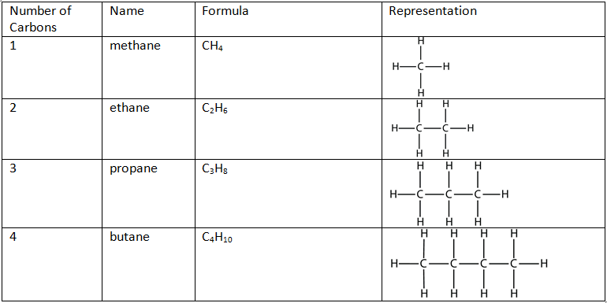
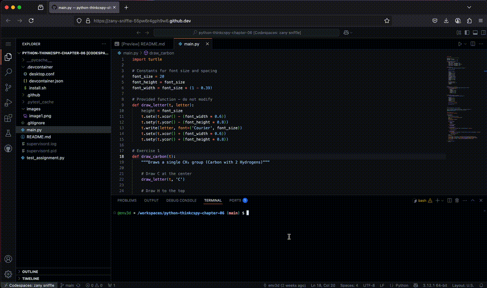

## Alkanes

In [organic chemistry](https://en.wikipedia.org/wiki/Organic_chemistry), an **alkane** consists of [hydrogen](https://en.wikipedia.org/wiki/Hydrogen) and [carbon](https://en.wikipedia.org/wiki/Carbon) atoms arranged in a [tree](https://en.wikipedia.org/wiki/Tree_\(graph_theory\)) structure (from wikipedia). Alkanes have the general chemical formula [C](https://en.wikipedia.org/wiki/Carbon)n[H](https://en.wikipedia.org/wiki/Hydrogen)2n+2 and the first few are summarized in the table below. You have likely heard of a few of them. Here are the first few:

 

The alkanes range in complexity from the simplest case of [methane](https://en.wikipedia.org/wiki/Methane), CH4 to arbitrarily large molecules. For a longer list look at  [https://en.wikipedia.org/wiki/Alkane\#Table\_of\_alkanes](https://en.wikipedia.org/wiki/Alkane%23Table_of_alkanes)

In main.py, we have several functions that together will form a drawing package for alkanes. The functions are:

- `draw_carbon`: Draws a single CH2 unit.
- `draw_carbons`: Draws a chain of CH2 units using a loop.
- `draw_carbon_chains`: Draws a full alkane chain by calling draw_carbons with the correct number of CH2 units.

Each function takes a parameter `t` which is a turtle object.  Your function will use this turtle object to draw the alkanes.

Unlike the textbook, you will not be creating a new turtle object in each function. Instead, you will be using the turtle object passed to you as a parameter. The turtle will be created in the GUI and passed to your functions. This allows you to draw the alkanes in a single window without creating multiple turtle objects.

To run the code, you will execute the `main.py` file using the following command:

```bash
python main.py
```

This will create a GUI which can be accessed under "PORTS" tab in codespaces, similar to the lab 2 challenge.

Below is a quick screen capture on how to use the GUI, there are a couple of differences between this and the lab 2 challenge. 

- Each button of the GUI correspond to a different function call, so you can test each function independently.
- You need to click the 'X' at the upper right corner of the GUI to close it, rather than using Ctrl+C in the terminal.



## Submit

As before, run pytest to check your code. You can run the tests using the following command:

```bash
pytest
```

Once you are ready, submit using the following command:

```bash
git add -A
git commit -m 'submit'
git push
```
